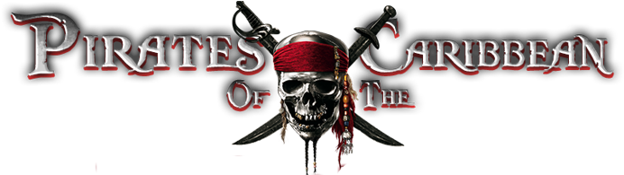
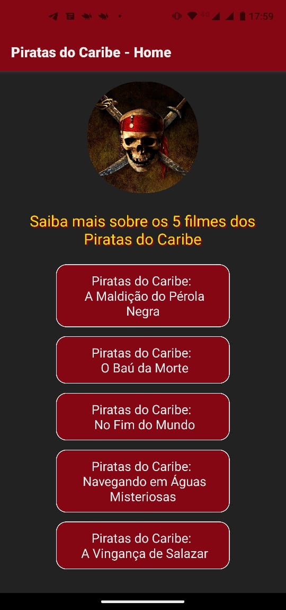
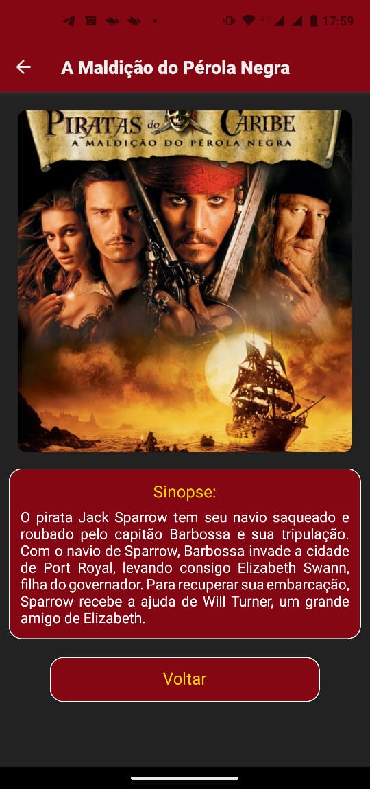

<h1 align="center">
    
</h1>

<div align="center">
   <a href="https://github.com/JohnPetros">
      
   </a>
   
   <a href="https://github.com/JohnPetros/piratas-do-caribe-filmes/commits/main">
      
   </a>
  </a>
   </a>
   <a href="https://github.com/JohnPetros/piratas-do-caribe-filmes/blob/main/LICENSE.md">
      
   </a>
    
</div>

## 🖥️ Projeto

Aplicativo multi-tela com o tema Piratas do Caribe que exibe informações a respeito dos 5 filmes da franquia. Primeiro projeto desenvolvido como tarefa para matéria de Programação Mobile na Etec

### Demonstração
<div align="center">
    
    
</div>
<hr>

## ✨ Funcionalidades

- Navegação por tela
- Exibição das imformações referentes a cada filme (título, imagem e sinopse)
<hr>

## 📖 Aprendizado

- Navegação de Telas,Componentização de telas,Funcionalidade de scroll   
- Estilização e tratamento de imagens
- Flexbox para alinhamento de elementos
- Conceitos de experiência do usuário,
- Design adaptado voltado telas menores,
- Eventos de clique,
- Efeito de sombra em textos,
<hr>

## 🚀 Tecnologias

Esse projeto foi desenvolvido com as seguintes tecnologias:

#### **Mobile** ([React Native](http://www.reactnative.com/))

- **[Expo](https://expo.io/)**
- **[React Navigation](https://reactnavigation.org/)**

## Instalação e execução

### Pré-requesitos

Antes de baixar o projeto você vai precisar ter instalado na sua máquina as seguintes ferramentas:

- [Git](https://git-scm.com)
- [NodeJS](https://nodejs.org/en/)
- [Yarn](https://yarnpkg.com/) ou [NPM](https://www.npmjs.com/)

Além disto é bom ter um editor para trabalhar com o código como [VSCode](https://code.visualstudio.com/)<br>4

> Você poder executar o App no seu celular ou em um emulador de celular da sua preferência usando Expo acessando este link: [expo.dev](https://snack.expo.dev/@joaopcarvalho/github.com-johnpetros-piratas-do-caribe-filmes).

#### 📟 Rodando o Mobile

```bash
# Clone este repositório
$ git clone  https://github.com/JohnPetros/piratas-do-caribe-filmes.git

# Acesse a pasta do projeto no terminal/cmd
$ cd piratas-do-caribe-filmes

# Instale as dependências
$ npm install

# Execute a aplicação em modo de desenvolvimento
$ npx expo start

```
---

## :memo: Licença

Esse projeto está sob a licença MIT. Veja o arquivo [LICENSE](LICENSE) para mais detalhes.

---

Feito com 💜 by João Pedro 👋🏻
